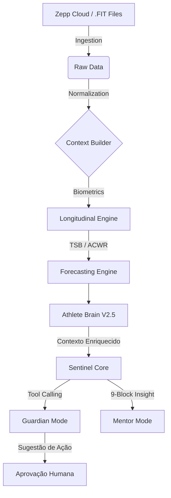

# 🛰️ PY-FIT SENTINEL OS: BLUEPRINT TÉCNICO v2.5

Este documento fornece um snapshot técnico do ecossistema Py-Fit, distinguindo a infraestrutura funcional da visão de longo prazo do **Sistema Operacional de Performance**.

---

## 🏗️ ARQUITETURA DE FLUXO (THE STACK)

O sistema opera em um pipeline de enriquecimento progressivo. O Sentinel não consome dados brutos; ele consome **sinais enriquecidos** pela memória longitudinal.

---

## 1️⃣ CAMADA DE HARDWARE (INGESTION)
*Interface de captura e sanitização.*

- **Zepp Cloud Bypass**: Extração via API interna, contornando proteções de segurança para obter JSONs de biometria.
- **FIT Processor**: Motor biomecânico para cálculo de **GAP** (Grade Adjusted Pace) e zonas de intensidade.

---

## 2️⃣ CAMADA DE MOTOR (BIO-ANALYTICS)
*Onde o dado vira métrica fisiológica.*

- **TSB (Training Stress Balance)**: Equilíbrio entre CTL (Fitness/42d) e ATL (Fadiga/7d).
- **ACWR (Acute:Chronic Workload Ratio)**: Métrica central de gestão de risco.
- **Risk Score Engine**: Algoritmo multi-fatorial que gera uma pontuação de 0 a 10.
    - **Lógica de Composição (Breakdown)**:
        - **Carga (ACWR/TSB)**: ACWR > 1.5 (+4), TSB < -20 (+3).
        - **Recuperação (HRV/RHR)**: HRV < 50ms (+2), RHR > 62bpm (+2).
        - **Lifestyle (Sono/Stress)**: Sono < 5.5h (+2), Stress > 70 (+1).

---

## 3️⃣ CAMADA DE MEMÓRIA (ATHLETE BRAIN V2.5)
*Consistência longitudinal e inferência.*

O **Athlete Brain** atua como uma camada de cache cognitivo que valida a recorrência de sinais antes de enviá-los ao núcleo de decisão.

- **Ciclo de Vida de Padrões**:
    1.  **HIPÓTESE (❓)**: Observação inicial (1-2 eventos).
    2.  **EMERGENTE (📊)**: Tendência identificada (3-6 eventos).
    3.  **CONFIRMADO (✅)**: **Consistência longitudinal detectada** (7+ eventos com alta confiança).
- **Enriquecimento**: Adiciona o "histórico de comportamento" ao dado do dia, permitindo que o Sentinel saiba se um HRV baixo é um evento isolado ou um padrão pós-treino conhecido.

---

## 4️⃣ CAMADA DE COMANDO (SENTINEL OS)
*O núcleo de sugestão e diretrizes.*

O Sentinel atua como um conselheiro técnico de elite, operando sob o gatekeeping da aprovação humana.

### 🛡️ MODO GUARDIÃO (Pré-Revisão)
*Foco em Integridade e Segurança.*
- **Sugestão de Remanejamento**: Utiliza *Function Calling* para propor alterações na grade de treinos se o `Risk Score >= 4`.
- **Alertas de Risco**: Identifica necessidade de ajustes em hidratação e repouso baseado nos deltas biométricos.

### 👨‍🏫 MODO MENTOR (Pós-Revisão)
*Foco em Veredito e Aprendizado.*
- **9-Block Verdict**: Análise clínica longitudinal (Status, Tradeoff, Forecast, etc).
- **Sith Persona**: Tom determinístico focado em otimização do "Hardware" (Corpo) e "Carga Útil" (Treino).

---

## 🚀 ESTADO DAS FUNCIONALIDADES

| Funcionalidade | Estado Atual | Descrição |
| :--- | :--- | :--- |
| **Daily Prefill** | ✅ Operacional | Automação completa de macros e biometria Zepp. |
| **TSB/ACWR Engine** | ✅ Operacional | Cálculo preciso de carga crônica e aguda. |
| **Athlete Brain** | ✅ Operacional | Registro e recuperação de padrões observacionais. |
| **Risk Score** | ✅ Operacional | Lógica multi-fatorial implementada no `ai_coach.py`. |
| **Function Calling** | ✅ Operacional | Sentinel sugere ações via ferramentas estruturadas. |
| **Auto-Weight Calibration** | ✅ Operacional | Auto-ajuste adaptativo com guard clauses (14d min), bounds e auditoria. |
| **Nutrient Management** | ✅ Operacional (Fases A+B) | Aderência diária vs. metas + RNS Experimental V1. Fase C (longitudinal, 14d guard) ativa. |

---

> [!IMPORTANT]
> **Nota de Governança**: O sistema é desenhado para **sugerir**, não para **executar** alterações sem supervisão. A inteligência é probabilística; a decisão final é sempre do Atleta.

*Sentinel OS: Precisão diagnóstica. Integridade sistêmica.* 🛰️🔥
